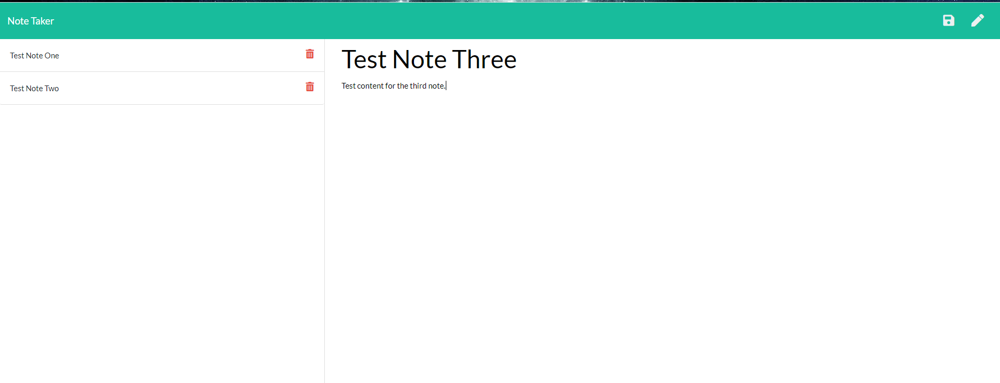

# Express Note Taker
 

## Description 
This app enables a user to organize their daily tasks, random thoughts, etc. into a simple note file. Within the app, a user can write, save, and delete notes. 

---

## Table of Contents
1. [Installation](#Installation)
2. [Usage](#Usage)
3. [License](#license)
4. [Contributing](#Contributing)
5. [Tests](#Tests)
6. [Questions](#Questions)
---

## Installation
1. Ensure that VS Code is installed on your computer 
2. Clone this app's repo to your computer 
3. Open the folder in terminal and install the Express package 

## Usage
The user the project, the user must first create a server by running the code below in the terminal:
~~~ 
node start 
~~~ 
Once the server is running, then the user can open their browser and input the URL `localhost:PORT` where PORT is `8080`.  Once inside the app, the user can then click "Get Started".  On the next screen, the user can then input their note title, their note content and click the save icon button in the top right corner. From there, the user can choose to create a new note using the pencil icon, or review or delete their previous notes from the saved note sections on the left of the screen. To be taken back to the home screen, click the "Note Taker" anchor in the top left of the screen,

---

## License
### ISC License
Copyright (c) 2020 Brianna Bullock

Permission to use, copy, modify, and/or distribute this software for any purpose with or without fee is hereby granted, provided that the above copyright notice and this permission notice appear in all copies.

THE SOFTWARE IS PROVIDED "AS IS" AND THE AUTHOR DISCLAIMS ALL WARRANTIES WITH REGARD TO THIS SOFTWARE INCLUDING ALL IMPLIED WARRANTIES OF MERCHANTABILITY AND FITNESS. IN NO EVENT SHALL THE AUTHOR BE LIABLE FOR ANY SPECIAL, DIRECT, INDIRECT, OR CONSEQUENTIAL DAMAGES OR ANY DAMAGES WHATSOEVER RESULTING FROM LOSS OF USE, DATA OR PROFITS, WHETHER IN AN ACTION OF CONTRACT, NEGLIGENCE OR OTHER TORTIOUS ACTION, ARISING OUT OF OR IN CONNECTION WITH THE USE OR PERFORMANCE OF THIS SOFTWARE. 

---
## Contributing
If a developer would like to contribute to this project, please send me an email at the email below.

## Tests
~~~JS
node start
~~~
---

## Questions

You can visit my [Github Profile](https://www.github.com/kairora) or [this app's Github repo](https://github.com/kairora/express-note-taker) to learn more about this CLI.
Or, if you have questions regarding this CLI program, please [send me an email](mailto:brianna.bullock16@gmail.com). 